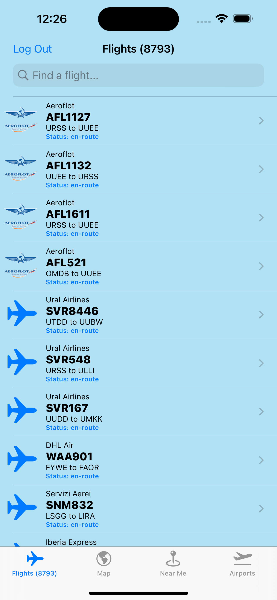

<h1 align="center">
   
  
   
  Flight Buddy
   
</h1>

<h4 align="center">A multi-user iOS application allowing aviation enthusiasts and travelers to track flights, find airports, and socialize in real time.</h4>

<em>This application was developed independently as my final project for <strong>CS-337: Enterprise Mobile Apps</strong> at <strong>Monmouth University</strong> during the <strong>Fall 2022</strong> semester.</em>

  <a href="#key-features">Key Features</a> •
  <a href="#key-implementations">Key Implementations</a> •
  <a href="#credits">Credits</a>

## Key Features

- Find and track flights
  - Scroll through flights around the world
  - Search for live flights by: flight number, airline, departure/arrival ICAO airport code
  - View live flight details: altitude, status, latitude/longitude
- Find airports
  - Scroll through airports around the world
  - Search for airports by: full name, ICAO airport code, country
- Search for airports near you
  - Display all airports within an adjustable radius around you
  - Get directions to airports near you
- Rate airports using stars and comments
  - Rate airports using a five-star scale
  - Comment on airports and optionally attach photos to your comments
- Socialize with other travelers

## Key Implementations

- AirLabs Data API
  - Real-time flight status and global aviation database
- Google Firebase
  - Authentication
  - Firestore allows for storage of users, airports, and users' social interactions
- FlagKit
  - Styled flag icon assets
- MVC methodology
  - Separation of the app's key components
- Observer pattern with Notifications service
  - Update models and views based on subscriptions to data updates
- UIKit
  - UINavigationController, UITabBarController, UITableViewController, Custom UITableViewCell, UISlider, UIStepper, UISearchController, UIRefreshControl, MapView, UIScrollView, UIImagePickerController, …
- LocalAuthentication
  - Supports biometric authentication via Face ID and Touch ID
- Security
  - Secure storage to and retrieval of user credentials from iOS Keychain
- CoreLocation
  - User location access
- MapKit
  - Supports building map-centric views
- MKGeodesicPolyline
  - Render geodesic polylines between coordinates (e.g., flight paths) over the curvature of the earth
- CoreGraphics
  - Supports rotation of map annotations
- Contacts
  - Enables communication with Apple Maps to provide the user directions to an airport

## Screenshots

  
  
  
  
  
  
  
  
  

## Credits

This software uses the following open source packages:

- [FlagKit](https://github.com/madebybowtie/FlagKit)
